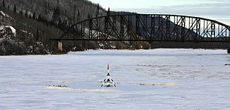
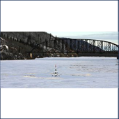
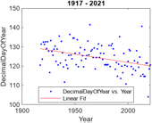

# Analyze Nenana Ice Classic

 or 

**Curriculum Module**

_Created with R2024a. Compatible with R2024a and later releases._

# Information

This curriculum module contains interactive [MATLAB® live scripts](https://www.mathworks.com/products/matlab/live-editor.html) that explore the Nenana Ice Classic datat set of ice breakup times from 1917 \- 2021.

## Background

Picture Source: [https://commons.wikimedia.org/wiki/File:Tanana\_River\_in\_Nenana.jpg](https://commons.wikimedia.org/wiki/File:Tanana_River_in_Nenana.jpg)

The Nenana Ice Classic is an annual event that takes place in Nenana, Alaska. It is a guessing game where people try to predict the exact time when the ice on the Tanana River will break up in the spring. Participants purchase tickets for a small fee and guess the month, day, hour, and minute when the tripod, which is placed on the frozen river, will move and stop the clock. The tripod is connected to a wire that is attached to a clock on the riverbank. When the ice starts to melt, the tripod moves with the current, and when it falls through the ice, the wire pulls a rope that stops the clock. You can find the exact dates and times of ice breakup have been collected since 2017 and reported on a calendar in the [Nenana Ice Classic Brochure](https://www.nenanaakiceclassic.com/brochures) on the [Nenana Ice Classic Website](https://www.nenanaakiceclassic.com/).

You can use these live scripts as demonstrations in lectures, class activities, or interactive assignments outside class. This module covers the engineering design process, mathematical modeling, fitting data to a linear model, and data analysis.  

The instructions inside the live scripts will guide you through the exercises and activities. Get started with each live script by running it one section at a time. To stop running the script or a section midway (for example, when an animation is in progress), use the  Stop button in the **RUN** section of the **Live Editor** tab in the MATLAB Toolstrip.

## Contact Us

Solutions are available upon instructor request. Contact the [MathWorks STEM Outreach team](mailto:%20stemoutreach@groups.mathworks.com) if you would like to request solutions, provide feedback, or if you have a question.

## Prerequisites

This module assumes knowledge of 

-  linear functions – graphing, writing equations, and slope. 
-  representing data as a table and scatter plot. 
-  modeling of an approximately linear situation with a line of fit. 

## Getting Started
### Accessing the Module
### **On MATLAB Online:**

Use the  link to download the module. You will be prompted to log in or create a MathWorks account. The project will be loaded, and you will see an app with several navigation options to get you started.

### **On Desktop:**

Download or clone this repository. Open MATLAB, navigate to the folder containing these scripts and double\-click on [Nenana.prj](https://matlab.mathworks.com/open/github/v1?repo=MathWorks-Teaching-Resources/Analyze-Nenana-Ice-Classic&project=Nenana.prj). It will add the appropriate files to your MATLAB path and open an app that asks you where you would like to start. 

Ensure you have all the required products (listed below) installed. If you need to include a product, add it using the Add\-On Explorer. To install an add\-on, go to the **Home** tab and select   **Add-Ons** > **Get Add-Ons**. 

## Products

MATLAB® is used throughout. Tools from the Curve Fitting Toolbox™ are used frequently as well. 

# Scripts

 *If you are viewing this in a version of MATLAB prior to R2023b, you can view the learning outcomes for each script* [*here*](https://www.mathworks.com/matlabcentral/fileexchange/REPO_NAME)

## [**Nenana1\_3.mlx**](./Nenana1_3.mlx) 
|     | **In this script, students will...**    -  Go through the first 3 steps of the Engineering Design Process to evaluate real\-world climate data.     -  Learn to use the 'Import Data' task to import data.    -  Use basic MATLAB commands to plot data.    -  Apply a basic linear regression to model real\-world climate data.     |
| :-- | :-- |

## [**Nenana4\_6.mlx**](./Nenana4_6.mlx) 
|     | **In this script, students will...**    -  Go through the last 3 steps of the Engineering Design Process to evaluate real\-world climate data.     -  Use a goodness\-of\-fit measure to assess model performance.    -  Learn about and apply R\-squared values to evaluate data.      |
| :-- | :-- |

# License

The license for this module is available in the [LICENSE.md](https://github.com/MathWorks-Teaching-Resources/Analyze-Nenana-Ice-Classic/blob/release/LICENSE.md).

# Related Courseware Modules

Feel free to explore our other [modular courseware content](https://www.mathworks.com/matlabcentral/fileexchange/?q=tag%3A%22courseware+module%22&sort=downloads_desc_30d).

# Educator Resources
-  [Educator Page](https://www.mathworks.com/academia/educators.html) 

# Contribute 

Looking for more? Find an issue? Have a suggestion? Please contact the [MathWorks STEM Outreach team](mailto:%20stemoutreach@groups.mathworks.com).

 *©* Copyright 2024 The MathWorks™, Inc

